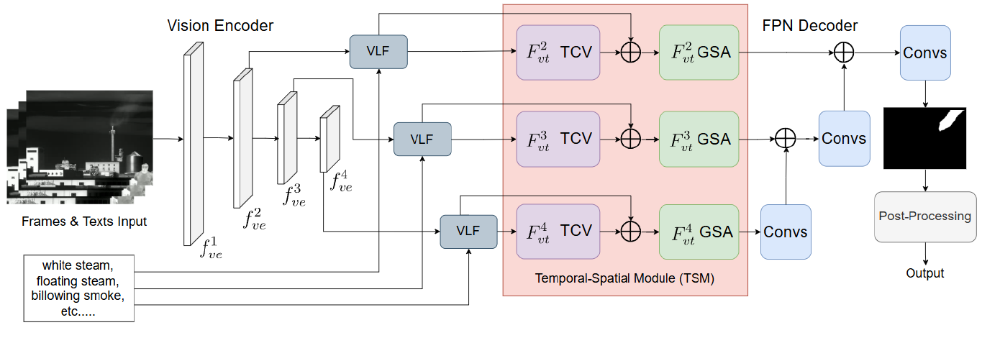
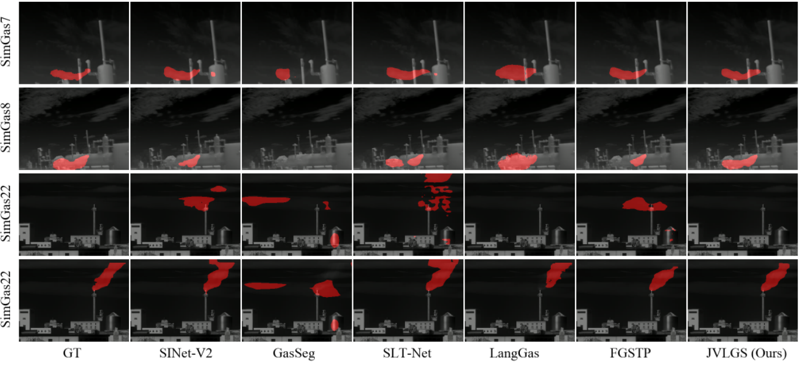
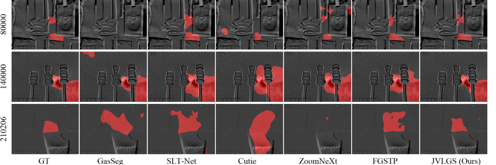

# JVLGS

📄 **Paper:** [JVLGS: joint vision–language gas leak segmentation](https://link.springer.com/article/10.1007/s00371-026-04591-y?status=info&saved-doi=10.1007%2Fs00371-026-04591-y)  

## Abstract

Gas leaks pose severe risks to human health and industrial safety. However, accurate and timely monitoring of gas leaks remains a major challenge. Existing vision-based methods using infrared (IR) imagery are limited by the inherently blurry and non-rigid nature of leak plumes, which reduces detection reliability and precision. To overcome these limitations, this paper proposes a Joint Vision–Language Gas Leak Segmentation (JVLGS) framework that integrates the complementary strengths of visual and textual modalities to enhance gas leak segmentation. Recognizing that gas leaks are sporadic and many video frames contain no leakage, JVLGS incorporates an adaptive postprocessing module to effectively suppress false positives caused by noise and non-target objects—a common limitation of existing approaches. Extensive experiments across diverse industrial scenarios demonstrate that JVLGS significantly outperforms state-of-the-art gas leak segmentation methods. Furthermore, it achieves consistently strong performance under both supervised and few-shot learning settings, whereas competing methods typically perform well in only one setting or underperform in both. 

## Method



**Figure 1. Framework of Joint Vision-Language Gas Leak Segmentation (JVLGS).** The inputs are video clips and text prompts of the target object. Visual and textual features are fused in the VLF module, followed by the Temporal-Spatial Module (TSM) and decoder. The post-processing removes false positives for final masks.

## Result

**Table 1. Quantitative comparison with benchmark methods on two datasets.**

| Models | Input Type | Year | SimGas J ↑ | SimGas F ↑ | SimGas J&F ↑ | IGS-Few J ↑ | IGS-Few F ↑ | IGS-Few J&F ↑ |
|---|---|---:|---:|---:|---:|---:|---:|---:|
| SINet-V2 | Image | 2021 | 37.29 | 42.76 | 40.03 | 17.45 | 28.15 | 22.80 |
| GasSeg | Image | 2024 | 37.35 | 46.16 | 41.76 | 55.40 | 67.00 | 61.20 |
| SLT-Net | Video | 2022 | 39.24 | 44.40 | 41.82 | 66.43 | 76.52 | 71.47 |
| Cutie | Video | 2024 | - | - | - | 46.61 | 59.07 | 52.84 |
| ZoomNeXt | Video | 2024 | 21.67 | 27.10 | 24.39 | 59.28 | 70.43 | 64.86 |
| LangGas | Video | 2025 | 53.57 | 63.95 | 58.76 | 10.66 | 15.16 | 12.91 |
| FGSTP | Video | 2025 | 39.45 | 44.42 | 41.94 | 66.70 | 76.56 | 71.63 |
| **JVLGS (Ours)** | **Video** | **2025** | **61.73** | **70.25** | **65.99** | **67.06** | **77.05** | **72.05** |

## Visualization



**Figure 4. Visualized results on SimGas.** Our model achieves the highest accuracy and generates whole-black masks for non-leak cases.



**Figure 5. Visualized results on IGS-Few.** Our model distinguishes the leak better than other models in few-shot learning.


## Start
```
conda create -n jvlgs python=3.8
conda activate jvlgs
```
install [2.4.1 pytorch, torchvision, and torchaudio](https://pytorch.org/get-started/previous-versions/) 

install [mmcv-full](https://mmcv.readthedocs.io/en/latest/get_started/installation.html) 
```
pip install mmcv-full
pip install mmsegmentation
```
The backbone is pre-trained on the COD10K dataset.   

[Dataset & Pretrained Backbone & Model Link](https://drive.google.com/drive/folders/1EuQyTL3lETJLGCM31Kh4IYmLsLcPoMQn?usp=sharing)
Our proposed model is trained on the IGS-Few and SimGas datasets, whose training files are available on the Drive link.

Please put the pretrained model into the ./pretrain folder, and please change the dataset_path.py to your dataset path.

## Train/Test SimGas dataset (k-fold training):
```
python kfold_train.py
python kfold_test.py
```
## Train/Test IGS-Few and other datasets (Few-shot or supervised):
```
python normal_train.py
python normal_test.py
```

## Citing 
```
@article{Zhao2026JVLGS,
  author  = {Zhao, Xinlong and Pang, Qixiang and Du, Shan},
  title   = {JVLGS: Joint Vision--Language Gas Leak Segmentation},
  journal = {The Visual Computer},
  year    = {2026},
  volume  = {42},
  number  = {10},
  article = {428},
  doi     = {10.1007/s00371-026-04591-y},
  url     = {https://doi.org/10.1007/s00371-026-04591-y}
}
```
